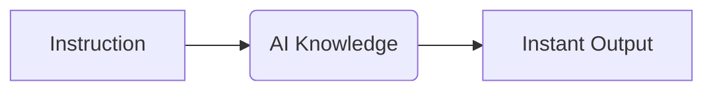

# 🌟 Zero-Shot Prompting: The AI’s "Just Ask and It Knows" Superpower

---

## 🎯 1. Crisp Definition  
**Zero-Shot prompting** is when you give an AI a direct instruction **without providing any examples**. You rely entirely on the AI's pre-existing knowledge to understand the task and generate the correct output instantly.

*(1 line only — perfect for interviews)*

---

## 🧠 2. Build Intuition First (Beginner’s Mindset)  
**Imagine walking into a massive library**:  
- 🏢 **The AI is the Librarian**: It has already read every book in the world.  
- 🗣️ **Zero-Shot**: You say, *"Give me a summary of Romeo and Juliet."*  
- ✅ **Result**: The librarian doesn't need you to show them how to summarize a book; they just **do it**.

**Why this works**: Models like GPT, Claude, and Llama have been "pre-trained" on the entire internet. They already know what a "fruit," a "legal contract," or "Python code" looks like. You just need to **point them in the right direction**.

---

## 📦 3. Structured Breakdown (Deep Dive)  
### 🔑 What It *Actually* Is  
- **Zero-Shot**: 0 examples given. Just the instruction (e.g., `Classify this email as Spam or Not Spam`).  
- **Goal**: Speed and simplicity. If the AI "knows" the concept, don't waste time giving examples.  
- **Key difference**: Unlike Few-Shot (where you show), Zero-Shot is where you **tell**.

### 💡 How It Works (Step-by-Step Flow)  
```mermaid
graph LR
    A[User Prompt] -->|Direct Instruction| B(AI Model)
    B -->|Activates Pre-trained Knowledge| C[Instant Prediction]
    C -->|Output| D[Accurate Result]
    
    subgraph Process
        A --> "Is 'Salmon' a fish?"
        B --> "Retrieves 'Salmon' properties"
        C --> "Matches Category: Fish"
        D --> "Yes"
    end
```
**Why this flow matters**: The AI doesn't learn a "new" pattern from you; it **unlocks** a pattern it already learned during training.

### ✅ Why It’s Powerful (Beyond the Basics)  
| **Why Zero-Shot Wins** | **Real-World Impact** |
|------------------------|------------------------|
| **Lowest Latency** | No extra tokens spent on examples = faster response. |
| **Simplicity** | Minimal prompt engineering required for common tasks. |
| **Scalability** | Works instantly for millions of users without custom data. |

---

## 🎨 4. Visual Thinking Elements (Text Diagrams)  
### 🔁 The Direct Path (ASCII Flow)  
```  
[User] ────────── (Instruction) ──────────> [AI] ──────────> [Result]
  |                                          |
 "Translate 'Hello' to French"             "Bonjour"
```  
**Pattern highlight**: *Question → Immediate Answer*  
*(Zero friction. Zero examples. Just results.)*

---

## 🧩 5. Memory Hooks  

### Mnemonic: **A.S.K.**
- **A** → **A**sk Directly  
- **S** → **S**imple Task  
- **K** → **K**nowledge Retrieval  

### Golden Rules
- “If it’s common sense, go Zero-Shot.”  
- “Clear instructions > massive examples.”  
- “Precision is the magic sauce.”

---

## 😂 6. Light Humor (Professional + Smart)  
> *"Zero-Shot is like asking your smartest friend where the best pizza in town is. They don't need you to show them photos of 'good pizza' first—they just know. (Unless they're a food critic, then you're in for a 20-minute Few-Shot lecture)."*

---

## ⚡ 7. Practical Examples (Tell vs. Show)  

| **Technique** | **The Prompt** | **The Logic** |
|-------------------|-------------------|-------------------|
| **Zero-Shot** | *"Extract the name from this text: 'My name is John Doe'"* | **Ask directly.** |
| **Few-Shot** | *"Name: Alice. Name: Bob. Text: 'My name is John' → Name:"* | **Show examples first.** |

**Real-world impact**: Use Zero-Shot for 80% of daily tasks (Summaries, translations, basic code). Save Few-Shot for the hard stuff.

---

## 🚫 8. Common Mistakes (Expanded for Depth)  

| **Mistake** | **Why It Fails** | **Fix** |
|----------------|-------------------|-------------------|
| **Ambiguity** | "Fix this" (Fix what? Grammar? Code? Sentiment?) | **Be Specific**: "Correct the grammar in this sentence." |
| **Assuming Context** | "Who is the CEO?" (Of which company?) | **Add Context**: "Who is the CEO of Microsoft as of 2024?" |
| **Lack of Persona** | Output is too generic or boring. | **Assign a Role**: "Summarize this as a Senior Data Engineer." |

---

## 🎯 9. Summary (Your Brain Shortcut)  
**In 3 words**: *Ask → Retrieve → Done*.  

**When to use it**:  
- ✅ **Common knowledge** (History, Science, etc.)  
- ✅ **Standard formats** (JSON, Markdown, CSV)  
- ✅ **Quick translations** or summaries.  

**What it doesn’t work for**:  
- ❌ **Custom business logic** (The AI doesn't know your company's internal rules).  
- ❌ **Complex formatting** (Where you need a very specific 'style').  

---

## 📥 How to Download This as an MD File  
1. **Copy the entire code block below**.  
2. **Paste into a `.md` file** (e.g., `1-ZeroShot.md`).  
3. **Open in any Markdown viewer**.  

```markdown
# 🌟 Zero-Shot Prompting: The AI’s "Just Ask and It Knows" Superpower

## 🎯 1. Crisp Definition  
**Zero-Shot prompting** is when you give an AI a direct instruction **without providing any examples**. It relies on pre-trained knowledge to generalize and execute the task instantly.

## 🧠 2. Build Intuition (Beginner’s Mindset)  
**The Library Clerk Analogy**: You don't show the clerk how to find a book; you just name the title. The AI is the librarian who has already read everything—you just need to **Ask Directly**.

## 📦 3. Structured Breakdown (Deep Dive)  
### 💡 How It Works (Step-by-Step Flow)  


### ✅ Why It’s Powerful  
| **Feature** | **Benefit** |
|-------------|-------------|
| **Speed** | Faster responses (no tokens wasted on examples). |
| **Ease** | Very low prompt-engineering effort. |

## 🎨 4. Visual Thinking (ASCII Path)  
`[User] --(Ask)--> [AI Knowledge Base] --(Result)--> [Output]`

## 🧩 5. Memory Hooks  
- **Mnemonic**: **A.S.K.** (Ask directly, Simple task, Knowledge retrieval).
- **Rule**: “Common sense = Zero-Shot.”

## 😂 6. Light Humor  
> *"AI has a Universal IQ but still needs a clear GPS. If you don't tell it where to go, don't be surprised if it ends up in the hallucination ocean."*

## 🚫 7. Common Mistakes  
1. **Ambiguity**: Being vague leads to 'average' answers.
2. **Missing Persona**: Not telling the AI *who* it should be.

## 🎯 8. Summary  
**Ask → Retrieve → Done.**  
Use it for: Summaries, Translations, General Q&A.  
Avoid for: Niche logic, Brand-specific voice.
```
