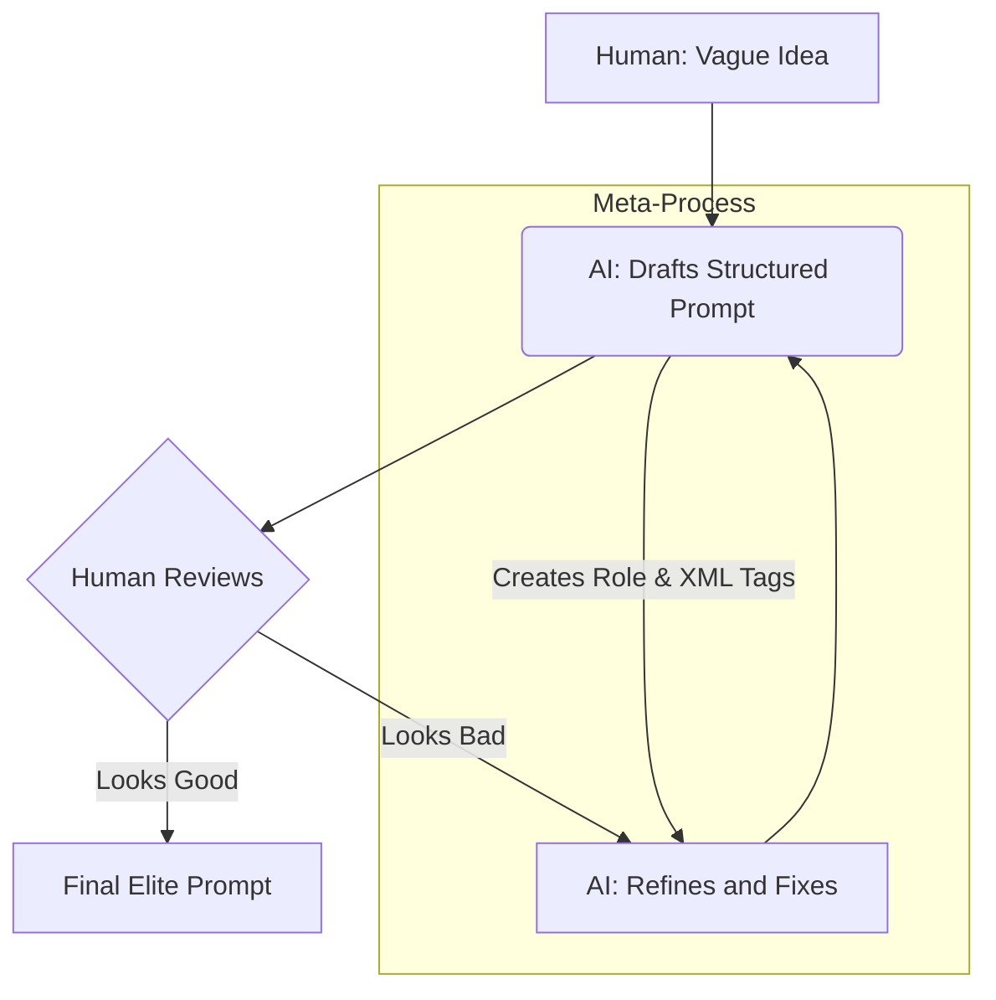

# 🌟 Structured & Meta Prompting: The AI’s "System Design" Playbook

---

## 🎯 1. Crisp Definition  
- **Structured Prompting**: Organizing instructions into a modular, machine-readable architecture (using tags like XML/JSON) to eliminate ambiguity.  
- **Meta-Prompting**: Using an AI to **write, refine, or analyze** its own prompts — essentially "prompting the AI to design the task."

*(Interview-ready tip: Structured is the **Layout**; Meta is the **Refinement Loop**.)*

---

## 🧠 2. Build Intuition First (Beginner’s Mindset)  
**Think like a Master Architect**:  
- 🏗️ **Structured Prompting**: You don't just dump bricks in a pile. You create a **blueprinted skeleton** (Role, Context, Constraints) so the AI knows exactly where every piece of information belongs.  
- 🤖 **Meta-Prompting**: You hire a **Master Designer (the AI)** to draw that blueprint for you because it knows exactly what the "construction crew" needs to hear.

**Why this matters**: As tasks get complex, a single paragraph of text fails. You need a **System**, not just a sentence.

---

## 📦 3. Structured Breakdown (Deep Dive)  
### 🔑 What It *Actually* Is  
- **Structure**: Uses **Tags** (e.g., `<context>`, `<task>`) to separate "Instructions" from "Data."  
- **Meta**: A **Recursive** process where the AI reviews its own prompt and improves it for clarity.  

### 💡 The Meta-Refinement Loop (Step-by-Step Flow)  

**Why this flow matters**: It shifts the burden of "Prompt Engineering" from the human to the AI. You become the **Reviewer**, not the writer.

### ✅ Why It’s Powerful (Beyond the Basics)  
| **Why This Wins** | **Real-World Impact** |
|-------------------|-------------------|
| **Deterministic** | Tags ensure the AI doesn't mix up "Context" with "Commands." |
| **Scalable** | Meta-prompts can generate 100 variations of a prompt in seconds. |
| **Error-Proof** | Structure forces "Guardrails" on the output (e.g., "Must be JSON"). |

---

## 🎨 4. Visual Thinking Elements (Text Diagrams)  
### 📍 The XML Blueprint (ASCII Layout)  
```  
<SYSTEM_ROLE> You are a Staff Data Engineer </SYSTEM_ROLE>
<CONTEXT> We are migrating from Sparks to Snowflake </CONTEXT>
<TASK> Write the migration script </TASK>
<CONSTRAINTS> No legacy Python 2.x code </CONSTRAINTS>
<OUTPUT_FORMAT> YAML only </OUTPUT_FORMAT>
```  
**Pattern highlight**: *Explicit Boundaries = Zero Hallucination.*

---

## 🧩 5. Memory Hooks  

### Mnemonic: **S.T.A.C.K.**
- **S** → **S**tructured Layout  
- **T** → **T**ags (XML/JSON)  
- **A** → **A**daptive (Meta Loops)  
- **C** → **C**ontextual Isolation  
- **K** → **K**nowledge-First  

### Golden Rules
- “Tags over Text (always).”  
- “Ask the AI: 'How would you improve this prompt?'”  
- “If it’s longer than a tweet, structure it.”

---

## 😂 6. Light Humor (Professional + Smart)  
> *"Meta-prompting is the AI equivalent of 'Inception.' You're prompting an AI to write a prompt that will be used by another AI. Just don't go too deep, or you'll wake up ten years later in a world where JSON is the only language anyone speaks."*

---

## ⚡ 7. Practical Examples (Before vs After)  

| **Messy Paragraph (Amateur)** | **Structured XML (Elite)** |
|--------------------------------|---------------------------|
| *"Hey AI, act as a coder and write a script to clean my csv but make sure it uses pandas and no nulls allowed."* | **`<role>`** Coder **`</role>`** <br> **`<library>`** Pandas **`</library>`** <br> **`<task>`** Clean CSV: Drop all Nulls **`</task>`** |

**Pro Tip**: Combined with Meta-Prompting, you ask the AI: *"Convert that messy paragraph into a structured XML format for better performance."*

---

## 🚫 8. Common Mistakes (Expanded for Depth)  

| **Mistake** | **Why It Fails** | **Fix** |
|----------------|-------------------|-------------------|
| **Wall of Text** | AI loses track of the core "Task" in the middle of long paragraphs. | **Use Tags**: Breaks the input into small, digestible chunks. |
| **Circular Meta Loops** | Asking for improvements 10 times until the prompt is too long. | **Stop at 2**: Perfection is the enemy of performance. |
| **Mixed Delimiters** | Using `---` and `###` and `<>` all in one prompt. | **Consistency**: Stick to one "Schema" (e.g., all XML tags). |

---

## 🎯 9. Summary (Your Brain Shortcut)  
**In 3 words**: *Structure → Refine → Scale*.  

**When to use it**:  
- ✅ **API & App Development** (Structured is mandatory).  
- ✅ **Complex Workflow Automation**.  
- ✅ **Prompt Optimization** (Using Meta-Prompting).  

**What it doesn’t work for**:  
- ❌ **Simple "What's the weather" questions**.  
- ❌ **Conversational "Vibe" checks**.  

---

## 📥 How to Download This as an MD File  
1. **Copy the code block below**.  
2. **Paste into `3-Structured-Meta-Prompting.md`**.  

```markdown
# 🌟 Structured & Meta Prompting: The AI’s "System Design" Playbook

## 🎯 1. Crisp Definition  
**Structured Prompting** is using architectural markers (like `<tags>`) to organize intent. **Meta-Prompting** is using the AI to write and refine these instructions automatically.

## 🧠 2. Build Intuition (Architect Analogy)  
Structured prompting is the **blueprint**; Meta-prompting is the **architect** who designs it. You move from writing instructions to managing the system that designs them.

## 📦 3. Structured Breakdown  
### 💡 The Meta-Loop  
`Human Idea` → `AI Draft (Structured)` → `Refinement` → `Elite Prompt`

### ✅ Why It Works  
- **Isolation**: Tags prevent commands from bleeding into context.
- **Recursive Power**: The AI knows the models' "tokens" better than you do.

## 🎨 4. Visual Thinking (The Tag System)  
`<role>` Expert `</role>`  
`<task>` Action `</task>`  
`<format>` JSON `</format>`

## 🧩 5. Memory Hooks  
- **Mnemonic**: **S.T.A.C.K.** (Structure, Tags, Adaptive, Context, Knowledge).
- **Rule**: “If the prompt is complex, it deserves a layout.”

## 😂 6. Light Humor  
> *"I asked an AI to write a prompt to improve its prompts. It gave me a 5,000-word XML schema. I think it's trying to build a career in project management."*

## 🚫 7. Common Mistakes  
- **Formatting Overload**: Don't use 5 different types of brackets; stay consistent.
- **Ignoring the Goal**: Structure is a tool, not the destination.

## 🎯 8. Summary  
**Structure → Refine → Scale.**  
Perfect for enterprise automation and mission-critical AI pipelines.
```
