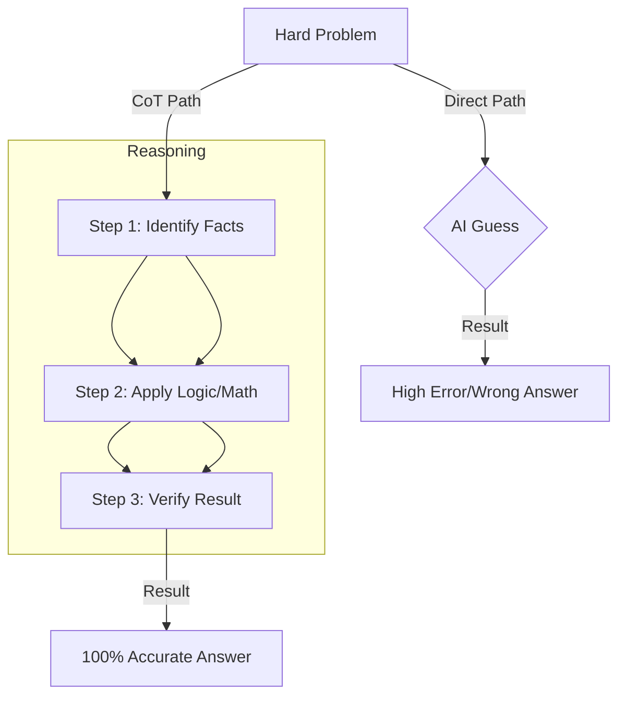

# 🌟 Chain of Thought (CoT): The AI’s "Show Your Work" Logic Engine

---

## 🎯 1. Crisp Definition  
**Chain of Thought (CoT)** is a technique where you instruct an AI to generate a sequence of intermediate reasoning steps before arriving at a final answer. It transforms the AI from a "guesser" into a "logician."

*(Interviews: "CoT is the process of breaking down complex problems into clear, logical steps to ensure accuracy.")*

---

## 🧠 2. Build Intuition First (Beginner’s Mindset)  
**Imagine you're taking a high-school Math Exam**:  
- ❌ **Wrong Way**: You look at the problem, guess the number, and write it down. If you're wrong, you get 0 points.  
- ✅ **Right Way**: You show every step—*"First, I'll multiply X. Then I'll subtract Y. Therefore, the result is Z."*  
- **The Magic**: Even if you make a tiny error, you (and the teacher) can see **how** you got there. Showing your work leads to fewer mistakes and "partial credit" for logic.

**Why this works**: Language models "predict" the next word. If they start a reasoning chain, they "anchor" themselves to the logic, making the final answer far more likely to be correct.

---

## 📦 3. Structured Breakdown (Deep Dive)  
### 🔑 The Two Flavors of CoT  
- **Zero-Shot CoT**: Just add one magic phrase: *"Let's think step by step."* (Modern models handle this naturally).  
- **Few-Shot CoT**: You provide 2–3 examples where YOU show the steps, teaching the AI the **format** of your logic.

### 💡 The Reasoning Path (Step-by-Step Flow)  

**Why this flow matters**: By slowing the AI down, you force it to process the "sub-problems" before tackling the big one.

---

## 🎨 4. Visual Thinking Elements (Text Diagrams)  
### 🌉 The Logic Bridge (ASCII Path)  
```  
[Input] ────[Reasoning Step A]────[Reasoning Step B]────> [Output]
   |                |                    |                 |
 "Hard Logic"    "Fact check"         "Math check"      "Success"
```  
**Pattern highlight**: *Don't jump across the canyon. Build the bridge.*

---

## 🧩 5. Memory Hooks  

### Mnemonic: **S.T.E.P.**
- **S** → **S**tate the input facts.  
- **T** → **T**hink through the logic.  
- **E** → **E**xecute the steps.  
- **P** → **P**roduce the final answer.  

### Golden Rules
- “Complexity requires steps.”  
- “If it’s math or logic, use CoT.”  
- “'Let's think step by step' is the ultimate cheat code.”

---

## 😂 6. Light Humor (Professional + Smart)  
> *"AI without CoT is like a toddler who runs full speed before looking at the floor. CoT is the AI putting on its 'Thinking Cap' and deciding that maybe, just maybe, it should avoid the Lego bricks of bad logic."*

---

## ⚡ 7. Practical Examples (Before vs After)  

| **Direct Answer (Failure)** | **Chain of Thought (Success)** |
|-----------------------------|-------------------------------|
| **Q**: "If John has 5 apples and eats 2, then buys 10 and gives half to Mary, how many does he have?" | **Step 1**: John starts with 5. <br> **Step 2**: Eats 2 → 5 - 2 = 3. <br> **Step 3**: Buys 10 → 3 + 10 = 13. <br> **Step 4**: Gives half to Mary → 13 / 2 = 6.5. <br> **Result**: 6.5 apples. |
| **Why**: Model might say "13" or "5" by rushing. | **Why**: The logic is impossible to ignore. |

---

## 🚫 8. Common Mistakes (Expanded for Depth)  

| **Mistake** | **Why It Fails** | **Fix** |
|----------------|-------------------|-------------------|
| **Infinite Reasoning** | AI goes down a rabbit hole of irrelevant facts. | **Constraint**: "Limit reasoning to 3 steps." |
| **Blind Formatting** | Using "Let's think step by step" for simple facts. | **Rule**: Don't use CoT for "What is the capital of France?" |
| **Logic Gaps** | The AI skips a crucial math step in its head anyway. | **Prompt**: "Always show the math for every subtraction." |

---

## 🎯 9. Summary (Your Brain Shortcut)  
**In 3 words**: *Break → Think → Solve*.  

**When to use it**:  
- ✅ **Math & Logic Problems**.  
- ✅ **Complex Planning or Coding Layouts**.  
- ✅ **Multi-stage Reasoning**.  

**What it doesn’t work for**:  
- ❌ **Simple Retrieval** (Who was the 1st President?).  
- ❌ **Creative Writing** (Where 'flow' is better than 'logic').  

---

## 📥 How to Download This as an MD File  
1. **Copy the code block below**.  
2. **Paste into `4-ChainOfThought.md`**.  

```markdown
# 🌟 Chain of Thought (CoT): The AI’s "Show Your Work" Logic Engine

## 🎯 1. Crisp Definition  
**Chain of Thought (CoT)** is a technique where you instruct the AI to process a problem through multiple intermediate reasoning steps before providing the final answer.

## 🧠 2. Build Intuition (Math Exam Analogy)  
AI is a high-speed calculator that sometimes forgets its own logic. By making it "Show Its Work," you ensure the path it takes is sound, reducing silly errors in math and logic.

## 📦 3. Structured Breakdown  
- **Zero-Shot CoT**: "Let's think step by step."
- **Few-Shot CoT**: Give examples with `Reasoning → Answer`.

### 💡 The Reasoning Path  
`Problem` → `Logic Step 1` → `Logic Step 2` → `Correct Result`

## 🎨 4. Visual Thinking (Logic Bridge)  
`[Input] --(Fact)--> [Step 1] --(Calc)--> [Step 2] --(Verify)--> [Output]`

## 🧩 5. Memory Hooks  
- **Mnemonic**: **S.T.E.P.** (State, Think, Execute, Produce).
- **Rule**: “Complexity needs steps.”

## 😂 6. Light Humor  
> *"AI jumping to conclusions is faster than a sprinter on caffeine. CoT is the coach reminding it to actually finish the race in the right lane."*

## 🚫 7. Common Mistakes  
1. **Over-Thinking**: Using it for simple questions.
2. **Unguided Reason**: Not specifying *how* it should think (e.g., "Think like a scientist").

## 🎯 8. Summary  
**Break → Think → Solve.**  
Essential for math, code, and complex planning.
```

---

# 📖 Comprehensive Guide: Using Chain-of-Thought Prompting

## In This Chapter
- What chain-of-thought prompting is and how it works
- When to use chain-of-thought prompting
- How to craft a chain-of-thought prompt
- Best practices for effective chain-of-thought prompting
- Advanced chain-of-thought prompting strategies
- Limitations of chain-of-thought prompting

---

## Introduction

Oftentimes, you prompt AI and only want a simple answer. Other times, however, it may be useful to understand exactly how an AI model figured out its result. When you need to know the thinking behind the AI, you need to use chain-of-thought prompting.

Instead of just providing a final answer, chain-of-thought prompting directs the AI to break down its reasoning into a series of intermediate steps. You're instructing the AI to show its work, which is useful when you're working with complex math or reasoning problems.

---

## What Chain-of-Thought Prompting Is and How It Works

Most people view AI as kind of a magic box. You ask it to do something (the prompt), your request goes into the magic AI box, and then you get the answer or output on the other side. You don't know or particularly care what happens in the middle; it all happens out of sight and behind the scenes.

That's fine for a lot of tasks where you really don't need to know how AI came up with its results. All you need is the answer or generated content, and what happens in the magic box doesn't matter to you.

There are other times, however, when it may be useful to see the steps that AI took to answer your question. Knowing the steps that AI took to get to the solution can help you better understand the problem or task at hand, as well as identify any flaws in the AI's logic.

That's where chain-of-thought prompting comes in. Chain-of-thought prompting is a way of instructing an AI model to show the reasoning steps it works through when it's solving a problem or answering a question. Instead of showing you only the final answer, the AI walks through its reasoning step-by-step, kind of like a student showing their work on a math problem.

In addition, some AI models actually perform better with reasoning tasks when they're instructed to generate these intermediate steps. It forces them to lean into their pattern recognition capabilities by mimicking how humans naturally think through such problems.

Initiating a chain-of-thought prompt is as simple as adding to your prompt something like "show your thinking step by step" or even just "step-by-step." That's enough to let the AI model know that it needs to show all the steps of its reasoning in its results.

---

## When to Use Chain-of-Thought Prompting

Chain-of-thought prompting is not practical for all types of tasks. If you just want a simple answer to a simple question, you don't need the AI to show its steps. (In fact, it probably doesn't have any steps if reasoning is not required.) You also don't need to use chain-of-thought prompting when you're generating specific types of creative output, such as reports, blog posts, translations, outlines, and the like.

Where the chain-of-thought prompting strategy shines is with tasks that require logic and reasoning. If the AI model needs to "think through" a task, you can use chain-of-thought prompting to have it show you the steps it is taking.

So, consider using chain-of-thought prompting for the following types of tasks:

- **Math problems**, especially word problems
- **Tasks that require combining information** or results from multiple prompts or sources of information (called multi-hop prompts)
- **Tasks where a conclusion must be derived** via logical reasoning or deduction from a set of facts or rules
- **Questions where the answer must be derived** from real-world knowledge
- **Planning or decision-making** when the AI model needs to weigh options and predict outcomes

### Example

For example, the following math word problem is an ideal candidate for chain-of-thought prompting:

> **Prompt:** Sandy has 5 boxes. Each box contains 10 pencils. She gives away 12 pencils to her friends. How many pencils does she have left? Show your work.

**AI Response (Chain-of-Thought):**

Let me work through this step by step:

**Step 1:** First, I need to find out how many pencils Sandy has in total.
- Sandy has 5 boxes
- Each box contains 10 pencils
- Total pencils = 5 boxes × 10 pencils per box = 50 pencils

**Step 2:** Next, I need to subtract the pencils she gave away.
- Sandy started with 50 pencils
- She gave away 12 pencils
- Pencils remaining = 50 - 12 = 38 pencils

**Answer:** Sandy has 38 pencils left.

This example shows how the AI breaks down the problem into logical steps: calculating the total number of pencils first, then subtracting the number given away. Each step shows the thinking process, making it easy to verify the logic and catch any potential errors.

---

## How to Craft a Chain-of-Thought Prompt

There are two ways to craft a chain-of-thought prompt.

### Method 1: Manual Approach

The first approach is to ask the AI model to "show your steps," "think step-by-step," or "think logically" by adding those words to the end of the prompt. For example, if you wanted to know how many days it would take to drive from Texas to Oregon, you could use the prompt:

> **Prompt:** Driving 8 hours a day, how many days does it take to drive from Dallas to Seattle? Think step by step.

**AI Response (Chain-of-Thought):**

Let me think through this step by step:

**Step 1:** Determine the driving distance from Dallas to Seattle.
- The approximate driving distance from Dallas, TX to Seattle, WA is about 2,100 miles

**Step 2:** Calculate total driving time.
- Average highway speed: approximately 60 mph
- Total driving time = 2,100 miles ÷ 60 mph = 35 hours

**Step 3:** Calculate the number of days needed.
- Driving 8 hours per day
- Days needed = 35 hours ÷ 8 hours/day = 4.375 days

**Answer:** It would take approximately 4.5 days (or realistically 5 days) to drive from Dallas to Seattle when driving 8 hours per day.

### Method 2: Few-Shot Approach

You can also combine chain-of-thought with few-shot prompting to provide the AI with examples of the step-by-step thinking you desire, as in the following example:

```
Examples:
Q1: There are 2 dogs. Each has 3 puppies. How many puppies are there in total?
A1: Each dog has 3 puppies. 2 × 3 = 6 puppies.

Q2: There are 5 baskets. Each basket has 4 apples. How many apples are there in total?
A2: Each basket has 4 apples. 5 × 4 = 20 apples.

New question:
There are 3 cars, each holding 4 people. How many people are there in total?
```

**Expected AI Response:**

```
A: Each car holds 4 people. 3 × 4 = 12 people.
```

By providing examples of the format and reasoning style you want, the AI learns to follow the same pattern for new questions.

In most instances, however, the manual method is the easiest approach.

---

## Best Practices for Effective Chain-of-Thought Prompts

For the best results when using chain-of-thought prompting, follow these best practices:

1. **Clearly and explicitly instruct** the AI to use step-by-step thinking. Don't assume the AI will always show its work.

2. **Structure your prompt** to naturally lead the model through the problem. If the problem has several distinct parts, consider using number lists or bullet points within the prompt to organize the information. (You can also lead the AI via ordered text, such as "first," "second," and "third.")

3. **Use clear and unambiguous language**. Avoid overly complex sentences, jargon, or ambiguous terms.

4. **For complex tasks**, ask for the answer separately after the steps have been presented. Use a prompt like "what is the final answer?"

**Example of Separating Steps from Final Answer:**

> **Prompt:** A store has a 25% off sale. If an item originally costs $80, and there's an additional 10% discount for members, how much does a member pay? Show your reasoning, then provide the final answer.

**AI Response:**

**Reasoning:**
1. First discount: $80 × 0.25 = $20 off
2. Price after first discount: $80 - $20 = $60
3. Second discount (on the reduced price): $60 × 0.10 = $6 off
4. Final price: $60 - $6 = $54

**Final Answer:** $54

---

### Comparison: Effective vs Ineffective Prompting

| **Ineffective Prompt** | **Effective Chain-of-Thought Prompt** |
|------------------------|---------------------------------------|
| "How many apples in 3 baskets of 5?" | "There are 3 baskets with 5 apples each. How many total apples are there? Think step by step." |
| Result: May just give "15" | Result: "Each basket has 5 apples. 3 baskets × 5 apples = 15 total apples." |
| **Why it fails:** No reasoning shown | **Why it works:** Clear instruction to show work |
| | |
| "Calculate compound interest for $1000" | "I invested $1000 at 5% annual interest, compounded yearly. Show your step-by-step calculation for the value after 3 years." |
| Result: Might give wrong formula or skip steps | Result: Shows formula, year-by-year calculations, and clear reasoning |

---

## Advanced Chain-of-Thought Prompting Strategies

There are several ways you can achieve even better results with chain-of-thought prompting, many involving combining chain-of-thought with other prompting strategies.

### Combining with Self-Consistency Prompting

For example, if you want to reduce the risk of receiving inaccurate results, combine chain-of-thought with self-consistency prompting. All you have to do is enter the same prompt (or the same prompt with slight variations) multiple times, then compare the different results, and see how they approach the problem. Choose the solution that appears most frequently.

> **Note**: Learn more about self-consistency prompting in Chapter 11, "Using Self-Consistency Prompting."

### Tree-of-Thought Prompting

Similarly, you can employ tree-of-thought prompting to generate multiple possibilities. Instead of asking for a single linear chain of reasoning, instruct the AI model to generate multiple potential reasoning paths, then evaluate the options and determine which path is most promising to pursue further.

At each step of the process, ask the AI model to produce several different next steps ("thoughts") and then prompt the model to evaluate the quality of each thought. ("Which of these approaches is most likely to lead to the correct answer?") Choose the most promising path and keep going until the final solution is reached.

**Example of Tree-of-Thought Prompting:**

**Problem:** You need to fit 12 different items into a suitcase. How should you approach this packing problem?

**Prompt 1:** "Generate three different approaches to packing 12 items in a suitcase."

**AI Response:**
- **Approach A:** Pack largest items first, then fill gaps with smaller items
- **Approach B:** Roll all clothing items tightly, then layer them systematically
- **Approach C:** Group items by category (clothes, toiletries, electronics), pack each group separately

**Prompt 2:** "Evaluate each approach. Which is most likely to maximize space efficiency?"

**AI Response:**
- Approach A is good but may waste space in corners
- **Approach B is best** - rolling saves space and prevents wrinkles
- Approach C is organized but may not optimize space usage

**Prompt 3:** "Using Approach B, provide step-by-step packing instructions for all 12 items."

**AI Response:** [Detailed rolling and layering instructions]

This method explores multiple solution paths before committing to the most promising one.

### Least-to-Most Prompting

Finally, when you're dealing with extremely complex problems, consider breaking the problem down into a series of simpler subproblems. Task the AI model with solving the easier subproblems first and then use those solutions in new prompts to solve the more complex subproblems. Continue in this fashion until the original, complex problem is solved. (This is called least-to-most prompting.)

**Example of Least-to-Most Prompting:**

**Complex Problem:** Plan a cross-country road trip from New York to California with optimal stops, budget management, and sightseeing.

**Break it down:**

1. **Subproblem 1:** "What are the major interstate routes from New York to California?"
   - Answer: I-80 (northern route), I-70 to I-15 (central route), I-40 (southern route)

2. **Subproblem 2:** "For the I-80 route, what are cities spaced about 300-400 miles apart for overnight stops?"
   - Answer: New York → Cleveland → Chicago → Des Moines → Cheyenne → Salt Lake City → Reno → San Francisco

3. **Subproblem 3:** "What are the estimated hotel and fuel costs for this route?"
   - Answer: [Detailed cost breakdown based on distances and average prices]

4. **Final Integration:** "Based on these stops and costs, create a 7-day itinerary with major attractions near each city, keeping total budget under $1,500."
   - Answer: [Complete integrated itinerary with all elements]

By solving each piece sequentially, you build up to the complex answer using verified intermediate results.

---

## Limitations of Chain-of-Thought Prompting

Chain-of-thought prompting is not without its issues, the first being that it isn't ideally suited for all types of AI-related tasks. You should also consider these additional limitations of the chain-of-thought model:

1. **Chain-of-thought prompting works best with large AI models**. Models working with smaller amounts of data can sometimes struggle to produce coherent reasoning steps and may, in fact, produce worse results than standard zero-shot prompting.

2. **Requires more computational resources** than other prompting strategies. If your access or resources are limited, you may want to choose a simpler prompting strategy.

3. **Slower than other prompting strategies** because it's more complex.

4. **May produce verbose answers** if you use the chain-of-thought strategy for relatively simple requests.

**Example of Unnecessary Verbosity:**

**Simple Question:** "What is 15% of 200?"

**Without CoT (appropriate):** "30"

**With CoT (unnecessarily verbose):**
"Let me solve this step by step:
- Step 1: Identify that we need to find 15% of 200
- Step 2: Convert 15% to decimal form: 15% = 0.15
- Step 3: Multiply 200 by 0.15
- Step 4: 200 × 0.15 = 30
- Final answer: 30"

**Lesson:** Save chain-of-thought for problems that actually need the reasoning breakdown.

5. **Highly sensitive to prompt wording and format**. The AI can be distracted by irrelevant information in the prompt or confused by the order of instructions. Changing the wording or order can result in wildly different results.

**Example of Sensitivity to Wording:**

**Prompt Version 1 (clear):**
"A train travels 60 miles per hour for 2 hours. How far does it go? Think step by step."
- Result: Correct reasoning → 60 mph × 2 hours = 120 miles

**Prompt Version 2 (with irrelevant info):**
"A train painted blue and red travels at 60 miles per hour for 2 hours on a Tuesday in the summer. The conductor wore a hat. How far does it go? Think step by step."
- Result: AI might get distracted by colors, day, season, or conductor details and provide confused reasoning

**Best Practice:** Keep prompts focused and eliminate unnecessary details that don't contribute to the problem.

6. **Reasoning isn't always correct**. While a given reasoning string might seem logical, that doesn't mean that it is. As with all things AI, always fully scrutinize the results.

**Example of Plausible but Incorrect Reasoning:**

**Prompt:** "A bat and ball together cost $1.10. The bat costs $1.00 more than the ball. How much does the ball cost? Think step by step."

**Incorrect AI Response (seems logical but is wrong):**
- The bat and ball cost $1.10 total
- The bat costs $1.00 more than the ball
- So the ball must cost $0.10
- And the bat costs $1.00
- Total: $1.00 + $0.10 = $1.10 ✓

**Why this is wrong:** If the ball costs $0.10, and the bat costs $1.00 MORE than the ball, the bat would cost $1.10, making the total $1.20, not $1.10!

**Correct reasoning:**
- Let x = cost of ball
- Then bat = x + $1.00
- Total: x + (x + $1.00) = $1.10
- 2x + $1.00 = $1.10
- 2x = $0.10
- x = $0.05

**Correct answer:** The ball costs $0.05, the bat costs $1.05.

This example shows why you must always verify the logic, even when the reasoning appears sound.

---

## Comparing Chain-of-Thought with Other Prompting Strategies

You should consider using chain-of-thought prompting in special cases only. It can overcomplicate simple tasks that are best achieved via zero-shot prompting and might not be necessary if you're using one- or few-shot prompting.

That said, chain-of-thought prompting is useful when you want to see the AI model's step-by-step reasoning. It can help you better understand how to get results, rather than just being presented with those results. It's certainly useful for specific types of math and logic problems that might not be suitable for other prompting strategies.

---

## Summary

In this chapter, you learned how to use chain-of-thought prompting to show the step-by-step thinking behind complex tasks. You learned when best to use chain-of-thought prompting, how to construct an effective chain-of-thought prompt, and how to use chain-of-thought with other prompting strategies.

Speaking of those other prompting strategies, I have one more strategy to share. Turn the page to learn all about self-consistency prompting—and how best to use it.
