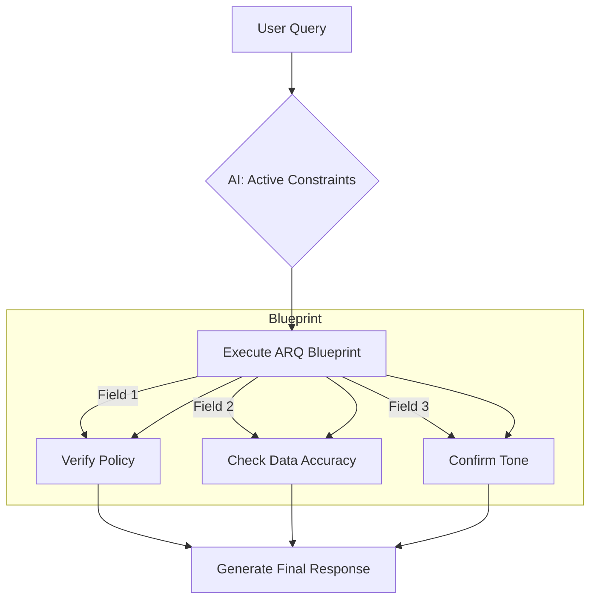

# 🎯 ARQ Prompting: The AI’s "Pre-Flight Checklist" for Perfection

---

## 🎯 1. Crisp Definition  
**Attentive Reasoning Queries (ARQ)** is a structured prompting technique where you require an AI to answer a predefined "blueprint" of specific questions (often in JSON format) before it generates its final output. It replaces free-form "thinking" with a mandatory checklist to ensure 100% adherence to instructions.

*(Interviews: "ARQ uses structured reasoning blueprints to reinforce constraints at the moment of decision-making.")*

---

## 🧠 2. Build Intuition First (Beginner’s Mindset)  
**Imagine you are a Pilot preparing for takeoff**:  
- ❌ **Wrong Way**: You sit in the cockpit and say, *"I'm going to think step-by-step about how to fly this plane."* (You'll likely forget a crucial switch).  
- ✅ **Right Way**: You pull out a **Laminated Checklist**.  
  1. *Fuel levels checked?*  
  2. *Flaps set to 15 degrees?*  
  3. *Radio link clear?*  
- **The Result**: You don't guess. You follow the **Blueprint**. ARQ is that laminated checklist for AI logic.

**Why this works**: By forcing the model to explicitly answer these questions *right before* the final output, you exploit the "Recency Effect"—the AI's attention is focused on its own checklist, preventing it from "drifting" away from your rules.

---

## 📦 3. Structured Breakdown (Deep Dive)  
### 🔑 The Anatomy of an ARQ  
- **The Blueprint**: A fixed set of queries (e.g., `<reasoning_fields>`).  
- **Selective Attention**: Forcing the AI to look at ONLY the facts relevant to the checklist item.  
- **Constraint Reinforcement**: Re-stating the rules inside the reasoning block.

### 💡 The ARQ Flow (Step-by-Step)  

**Why this flow matters**: In Free-form CoT, the AI might ramble. In ARQ, the AI **cannot move forward** until every field in the blueprint is filled.

---

## 🎨 4. Visual Thinking Elements (Text Diagrams)  
### 🧾 The JSON Reasoning Block (ASCII)  
```json
{
  "ARQ_Blueprint": {
    "Intent_Check": "User is asking for a refund",
    "Policy_Check": "Refunds only within 30 days",
    "Customer_Status": "Active Support Plan",
    "Safety_Guardrail": "Do not share internal credit codes"
  }
}
```  
**Pattern highlight**: *Structure > Freedom. Checklist > Rambling.*

---

## 🧩 5. Memory Hooks  

### Mnemonic: **B.E.A.M.**
- **B** → **B**lueprint (Predefined queries).  
- **E** → **E**xplicit (No guessing).  
- **A** → **A**ttention (Focus on the now).  
- **M** → **M**andatory (Completion required).  

### Golden Rules
- “Don't let the AI think; give it a list.”  
- “JSON is the language of logic.”  
- “Recency = Reliability.”

---

## 😂 6. Light Humor (Professional + Smart)  
> *"AI models have the attention span of a goldfish in a blender. ARQ is like taping a 'Don't Forget Your Lunch' note to the AI's forehead right before it walks out the door. It's simple, it's structured, and it stops the 'Oh wait, I forgot the rules' hallucinations."*

---

## ⚡ 7. Practical Examples (Before vs After)  

| **Chain of Thought (Unstructured)** | **ARQ Prompting (Structured)** |
|-------------------------------------|-------------------------------|
| *"Think step-by-step about the customer's request and answer politely."* | **Blueprint Query**: <br> 1. Is the request within policy? <br> 2. What is the required tone? <br> 3. List the 3 facts needed. |
| **Why**: AI might forget rule #3 halfway through its thinking. | **Why**: AI is forced to write down the 3 facts *immediately before* answering. |

**Real-world impact**: Frameworks like *Parlant* use ARQ to achieve 90%+ accuracy in complex customer service logs where CoT often fails.

---

## 🚫 8. Common Mistakes (Expanded for Depth)  

| **Mistake** | **Why It Fails** | **Fix** |
|----------------|-------------------|-------------------|
| **Vague Blueprint** | "Think about the rules" is too broad. | **Be Granular**: "Does the answer contain PII? (Yes/No)." |
| **Irrelevant Queries** | Overloading the blueprint with 20 questions. | **Stick to 3-5**: Use the "Attention" window wisely. |
| **Missing the Link** | Forgetting to ask the final answer to *use* the ARQ data. | **Instruction**: "Based on the ARQ_Blueprint above, write the response." |

---

## 🎯 9. Summary (Your Brain Shortcut)  
**In 3 words**: *Blueprint → Check → Launch*.  

**When to use it**:  
- ✅ **Mission-Critical Agents** (Finance, Health, Legal).  
- ✅ **Strict Policy Adherence** (Customer Support).  
- ✅ **Multi-turn Conversations** (Preventing instruction drift).  

**What it doesn’t work for**:  
- ❌ **Creative Brainstorming** (Checklists kill creativity).  
- ❌ **Simple Trivia** (Overkill).  

---

## 📥 How to Download This as an MD File  
1. **Copy the code block below**.  
2. **Paste into `7-ARQ.md`**.  

```markdown
# 🎯 ARQ Prompting: The AI’s "Pre-Flight Checklist" for Perfection

## 🎯 1. Crisp Definition  
**ARQ (Attentive Reasoning Queries)** is a technique where the model fills out a structured "blueprint" of predefined reasoning fields (mandatory queries) before generating a final response.

## 🧠 2. Build Intuition (Pre-Flight Checklist)  
Don't ask the AI to "think step by step." Give it a mandatory checklist. Like a pilot before takeoff, the AI must verify every switch and gauge before it's allowed to "fly" your response.

## 📦 3. Structured Breakdown  
- **Blueprint**: Predefined queries replace random thinking.
- **Attention**: Forces the model to look at rules *immediately before* output.

### 💡 The Flow  
`Query` → `Check Checklist Fields (D, E, F)` → `Result`

## 🎨 4. Visual Thinking (JSON Blueprint)  
`{ "Policy": "Checked", "Data": "Verified", "Tone": "Polite" }`

## 🧩 5. Memory Hooks  
- **Mnemonic**: **B.E.A.M.** (Blueprint, Explicit, Attention, Mandatory).
- **Rule**: “Checklist before Launch.”

## 😂 6. Light Humor  
> *"ARQ turns your AI from an impulsive teenager into a systematic project manager. It's less 'vibes' and more 'verify'."*

## 🚫 7. Common Mistakes  
- **Broad Queries**: Vague questions lead to vague answers.
- **Query fatigue**: Don't ask 50 questions; focus on the critical few.

## 🎯 8. Summary  
**Blueprint → Check → Launch.**  
The gold standard for reliable, policy-driven AI agents.
```
